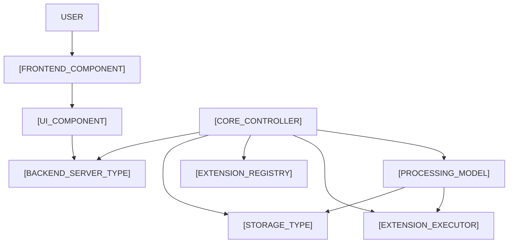

# STRUCTURE Format Guidelines

This STRUCTURE file provides a comprehensive overview of the project structure.

### Include the following sections:

* **I. Project Overview**: Provide a brief overview of the project, including its goals and objectives.
* **II. Component Structure**: Describe the component structure of the project, including the relationships between components.
* **III. Feature Breakdown**: Break down the project into its key features, including a brief description of each feature.
* **IV. Technical Requirements**: Outline the technical requirements for the project, including hardware, software, and infrastructure needs.
* **V. System Architecture**: Describe the system architecture of the project, including the relationships between components and systems.
* **VI. Data Flow**: Outline the data flow of the project, including the inputs, processing, and outputs.
* **VII. Security and Authentication**: Describe the security and authentication mechanisms used in the project, including any encryption, access controls, or authentication protocols.

### Use the following format for each section:

* **[Section]**: Use a header with the section number and title.
* **[Subsection]**: Use a subheader with the subsection title.
* **[Description]**: Briefly describe the section or subsection.
* **[Diagram or Graph]**: Include a diagram or graph to illustrate the concepts and relationships described in the section.

### Example:

```markdown
## I. Project Overview

* Provide a brief overview of the project, including its goals and objectives.
* Date: [date]

## II. Component Structure

* Describe the component structure of the project, including the relationships between components.
* Date: [date]
```

### Include a diagram:



## Include a Directory Organization

```
Project_Name/
    ├──.docs/                    ► Contains project documentation
    │   ├── steering/            ► Contains project vision and planning documents.
    │   │   ├── product.md       ► Defines the product vision, features, and target audience.
    │   │   ├── tech.md          ► Outlines the technical stack for the project.
    │   │   └── structure.md     ► Describes the project structure (this file).
    │   │
    │   ├── spec/                ► Contains project specifications 
    │   │   ├── design.md        ► Defines the system design and architecture. 
    │   │   ├── requirements.md  ► Outlines the functional and non-functional requirements.
    │   │   └── tasks.md         ► Lists the tasks and action items for the project.
    │   └── agents.md            ► Describes the agents involved in the system or project.
    │
    ├── .gitignore               ► Specifies files and directories to exclude from version control.
    └── README.md                ► Provides an overview of the project in the root directory.
```

### Note:

* Use a consistent format throughout the file.
* Keep the descriptions brief and concise.
* Use proper grammar and spelling.

### Generate a STRUCTURE.md file that includes the following information:

* [Insert information about the project overview and goals]
* [Insert information about the component structure and relationships]
* [Insert information about the feature breakdown and technical requirements]

### Use a formal and technical tone throughout the file.