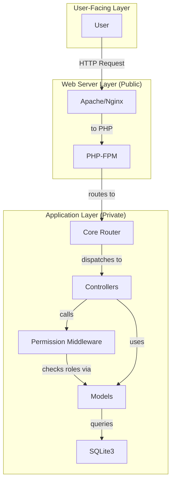

# Project Blueprint: MyRestorePro

## I. Executive Summary

This document provides a high-level technical blueprint for the MyRestorePro web application. The project's goal is to create a robust, secure, and user-friendly online platform for a restoration and removal business. A key feature is the role-based access control (RBAC) system that provides tailored experiences for clients, staff, vendors, and administrators.

## II. System Architecture Overview

The system uses an MVC pattern with a dedicated middleware component for handling authorization. This ensures a clean separation of concerns between routing, access control, and business logic.

## III. Request-Response Flow Example (Staff Dashboard Access)

1.  **Request**: A logged-in staff member attempts to access `/staff/dashboard`.
2.  **Routing**: The `Router` maps the URL to the `dashboard` method in the `StaffController`.
3.  **Middleware Execution**:
    - The first line of `StaffController::dashboard()` calls `PermissionMiddleware::handle(['Staff', 'Manager', 'Admin'])`.
    - The middleware checks if the user is authenticated via `Auth::requireAuth()`.
    - It fetches the user's roles from the session or database.
    - It checks if the user has one of the required roles.
    - If the user is not authorized, it terminates the request with a 403 Forbidden error.
4.  **Controller Logic**: If authorization succeeds, the controller proceeds to fetch data needed for the staff dashboard.
5.  **Response**: The controller renders the staff dashboard view and returns it to the user.

## IV. Key Components

- **PermissionMiddleware**: A static class that provides a `handle` method to protect controller actions based on user roles.
- **User Model**: Contains the logic for fetching a user's roles and permissions from the database, utilizing the `V_UserEffective` and `V_UserEffectiveNames` views.
- **AuthController**: Manages the magic link login flow and the initial role-based redirection.

## V. Technical Requirements

- **Backend**: PHP >= 8.1
- **Database**: SQLite3
- **Frontend**: HTMX, Tailwind CSS 4.1
- **Dependencies**: Composer (PHP), npm (JS)

## VI. Security and Authentication

- **Authentication**: A secure, passwordless "magic link" system.
- **Authorization**: A comprehensive RBAC system controls access to all non-public parts of the application. The permission schema is based on groups, permissions, and bitmasks, allowing for fine-grained control. The `PermissionMiddleware` is the gatekeeper for all restricted routes.

## VII. Data Management

- **Primary Storage**: A single SQLite database file (`app/app.db`).
- **Schema**: The database schema includes tables for `users`, `groups`, `permissions`, and their relationships.
- **Migrations**: Schema changes are managed through SQL migration files.

## VIII. Testing and Quality Assurance

- **Current Status**: The testing environment is currently broken and needs to be fixed as a high priority.
- **Strategy**: Once fixed, the strategy is to write unit tests for all business logic (especially the RBAC system in the `User` model) and feature tests for key user flows like login and redirection.
