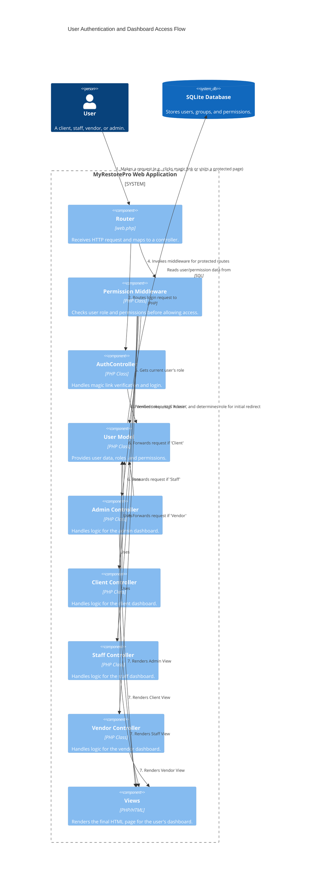

# Codebase Relationships (C4-Style)

This document provides a C4-style view of the key architectural components and their relationships within the MyRestorePro application. The main focus is on the user authentication and role-based routing flow.

## High-Level Model

-   **System:** MyRestorePro System
-   **Containers:** Web Application (PHP/HTMX), Database (SQLite)
-   **Components:** Router, Middleware, Controllers, Models, Views

---

## C4 View: User Authentication and Dashboard Access

This diagram illustrates the flow for a user authenticating via a magic link and accessing their role-specific dashboard.

### Diagram

### Explanation of the Flow

1.  **Request Initiation:** A `User` (who could be a Client, Staff, Vendor, or Admin) makes an HTTP request. This could be clicking a magic link to log in or accessing a page that requires authentication.

2.  **Routing:** The `Router` (`web.php`) receives the request.
    *   For a magic link login, it routes the request to the `AuthController`.
    *   For a protected page (like `/admin/dashboard`), it first invokes the `PermissionMiddleware`.

3.  **Authentication (`AuthController`):**
    *   When handling a magic link, the `AuthController` uses the `User Model` to verify the token.
    *   Upon successful verification, it logs the user in and redirects them to their designated dashboard (`/admin`, `/client`, etc.) based on their role.

4.  **Authorization (`PermissionMiddleware`):**
    *   For any route protected by the middleware, it checks if a user is logged in.
    *   It then communicates with the `User Model` to get the user's role (e.g., 'Admin').
    *   If the user's role matches the role required for the route, the request is allowed to proceed to the designated controller. Otherwise, it's rejected.

5.  **Controller Logic:** The role-specific controller (e.g., `AdminController`) handles the business logic for the request. It may interact with various `Models` (like the `User Model` or `Quote Model`) to fetch or manipulate data.

6.  **Database Interaction:** All data, including users, roles, permissions, quotes, and services, is stored in the `SQLite Database`. Models interact with the database via the `Database Core` layer.

7.  **View Rendering:** The controller passes data to the appropriate `View`, which then renders the final HTML that is sent back to the user's browser.

---

## Example Trace: Landing Page Load

This section provides a concrete example of the application flow by tracing the rendering of the public landing page, including both server-side execution and client-side asset loading.

**Request:** `GET /`

### 1. Server-Side Execution Flow

*   **Entry Point:** `public_html/index.php` boots the application.
*   **Routing:** `app/routes/web.php` maps the `/` route to `HomeController@index`.
*   **Controller:** `app/src/Controllers/HomeController.php` fetches all necessary data for the landing page.
*   **Models & Database:** It queries the `settings`, `services`, `site_benefits`, and `testimonials` tables via their corresponding models.
*   **View Rendering:** The controller renders the page content from `app/views/public/pages/home.php` and wraps it in the main layout `app/views/layouts/main.php`.

### 2. Client-Side Assets Loaded by Browser

*   **Layout Partials:** The `main.php` layout includes `app/views/public/partials/hero.php` and `app/views/partials/footer.php`.
*   **Stylesheet:** `/static/css/styles.css`
*   **JavaScript Files:** `/static/js/htmx.min.js` and `/static/js/main.js`.
*   **Images:** `/static/images/favicon.png` is loaded, plus any images referenced in the CSS or the included view partials.
*   **Other:** Inline JavaScript for analytics and CSRF protection is also present.

**Summary of Touched Files & Tables:**

*   **Execution Flow:** `index.php` → `web.php` → `HomeController.php` → `Controller.php`
*   **Core Classes:** `Database.php`, `Router.php`, `View.php`, `Security.php`, `Model.php`
*   **Models:** `Setting.php`, `Service.php`, `SiteBenefit.php`, `Testimonial.php`
*   **Views:** `main.php` (layout), `hero.php`, `footer.php`, `home.php` (page content)
*   **Static Assets:** `styles.css`, `htmx.min.js`, `main.js`, `favicon.png`
*   **Database Tables Queried:** `settings`, `services`, `site_benefits`, `testimonials`
