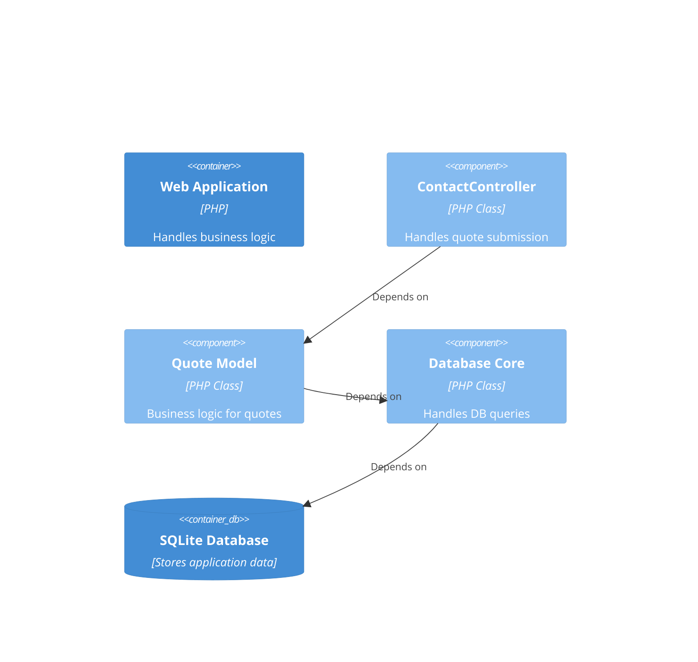

# Codebase Relationships (C4-Style)

## Documents

### Context
- name: MyRestorePro System
  type: system
  relationships:
    - depends_on → SQLite Database

### Containers
- name: Web Application
  type: container
  technology: PHP + HTMX
  responsibilities: Handles all business logic, serves HTML pages, and manages user interactions.
  relationships:
    - depends_on → Database

- name: Database
  type: container
  technology: SQLite
  responsibilities: Stores all application data, including users, quotes, contacts, and services.
  relationships: []

### Components (Example: Quote Submission)
- name: ContactController
  type: controller
  relationships:
    - type: depends_on
      target: Quote Model

- name: Quote Model
  type: model
  relationships:
    - type: depends_on
      target: Database Core

### Code / Infrastructure
- name: Database Core
  type: infrastructure
  technology: PHP (PDO)
  responsibilities: Handles the connection to the SQLite database and executes all queries.
  relationships: []

---

## C4 View

### Components (Quote Submission Flow)

