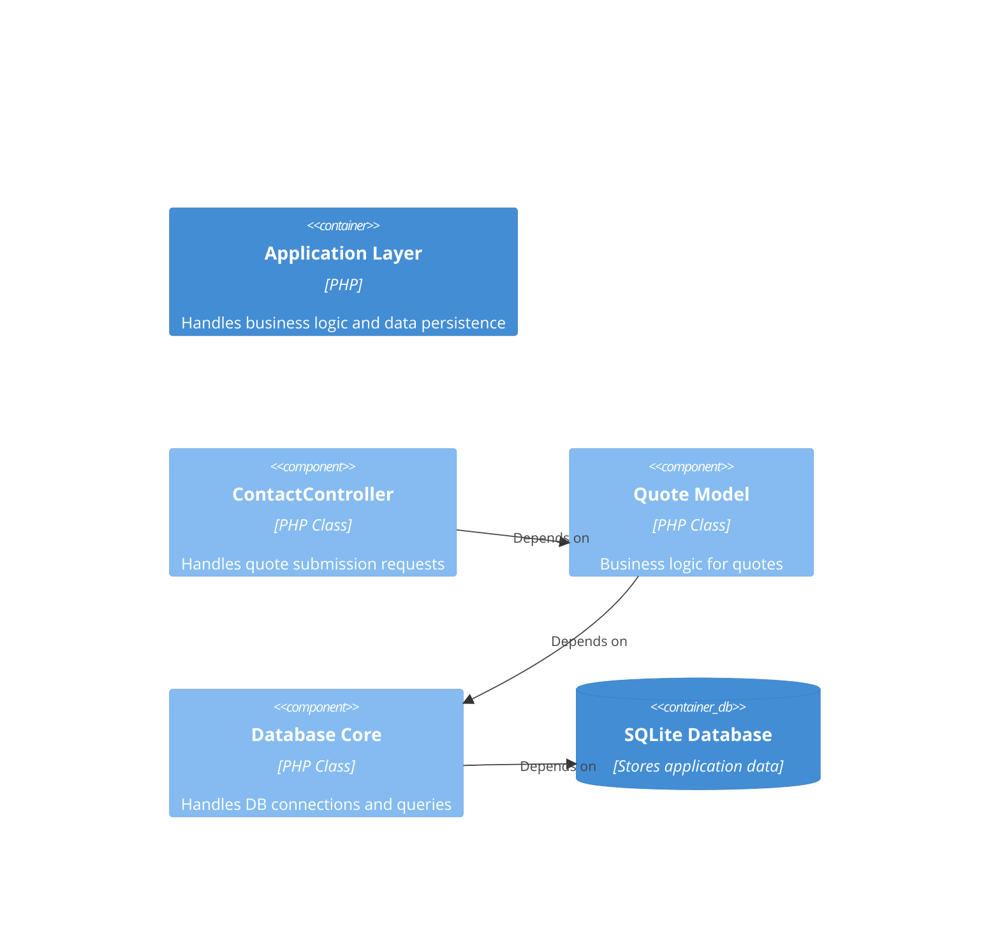

# Codebase Relationships

This document outlines the typical relationships between different components in the MyRestorePro codebase.

## Documents

- **ContactController**
  - type: controller
  - relationships:
    - depends_on → Quote (Model)

- **Quote (Model)**
  - type: model
  - relationships:
    - depends_on → Database (Core)

- **Database (Core)**
  - type: infrastructure
  - relationships:
    - none

---

## C4 View

This diagram shows the component relationships for a typical data flow, such as submitting a quote.

### Components (Application Layer)

