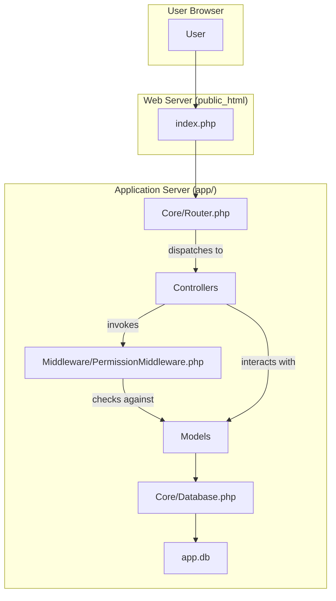

# Project Structure: MyRestorePro

This document provides a comprehensive overview of the project structure for MyRestorePro.

## I. Project Overview

MyRestorePro is a web application designed to serve as the online presence for a restoration and removal business. It includes a public-facing website, a lite CMS, and a multi-faceted user portal with role-based access control.

## II. Component Structure & System Architecture

The application uses a bespoke PHP MVC architecture with a clear separation of concerns. A new middleware layer has been introduced to handle access control.



## III. Feature Breakdown

- **Public Website**: Home, Services, Contact, Quote pages.
- **Role-Based Hubs**:
  - `/client/dashboard` for customers.
  - `/staff/dashboard` for employees.
  - `/vendor/dashboard` for partners.
- **Admin Panel**: Comprehensive management of the site and its users.
- **Authentication**: Unified magic link login with role-based redirection.

## IV. Technical Requirements

- **Server**: PHP >= 8.1, Apache/Nginx with `mod_rewrite`.
- **Database**: SQLite 3.
- **Frontend**: HTMX, Tailwind CSS 4.1, npm.

## V. Data Flow

1.  **User Request**: Request hits `index.php`.
2.  **Routing**: The `Router` maps the URL to a `Controller` method.
3.  **Middleware**: The `Controller` method calls the `PermissionMiddleware` to check for appropriate user roles.
4.  **Controller Logic**: If authorized, the controller fetches data from `Models`.
5.  **Response**: The `Controller` renders a `View` which is returned to the user.

## VI. Security and Authentication

- **Web Root Isolation**: `app/` directory is outside `public_html`.
- **RBAC**: The new permission system, powered by the database schema and `PermissionMiddleware`, controls access to all non-public routes.
- **Authentication**: Secure, passwordless magic link system.

## VII. Directory Organization

```
MyRestorePro/
├── app/
│   ├── src/
│   │   ├── Controllers/
│   │   ├── Core/
│   │   ├── Middleware/     ► Contains access control logic.
│   │   └── Models/
│   ├── views/
│   │   ├── client/         ► Views for the Client Hub.
│   │   ├── staff/          ► Views for the Staff Hub.
│   │   └── vendor/         ► Views for the Vendor Hub.
│   ├── database/
│   │   └── migrations/
│   └── ...
├── public_html/
├── project_docs/
├── docs/
└── ...
```
